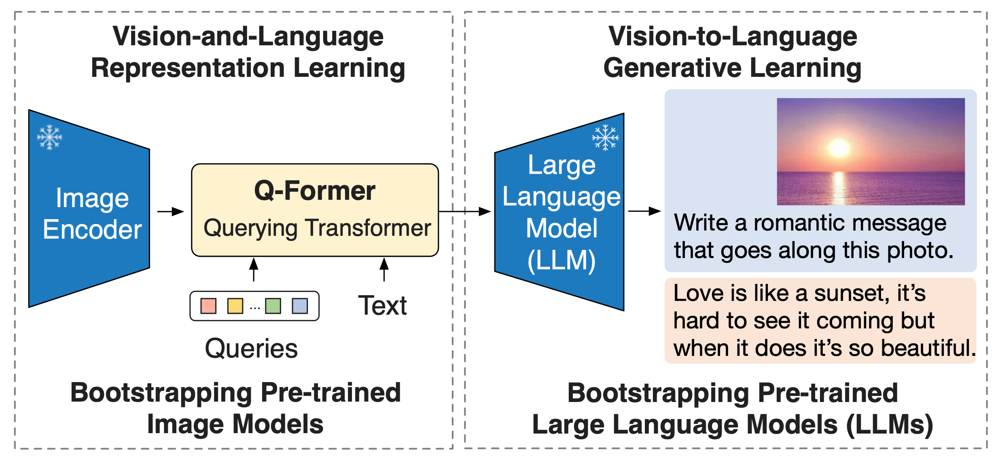

# 한국어 GQA 데이터 질의응답을 위한 Bootstrapping Language-Image Pre-training with Frozen Image Encoders and Large Language Models (BLIP-2)

본 레포지토리는 이미지 질의 응답 작업을 위한 [BLIP-2](https://github.com/salesforce/LAVIS/tree/main/projects/blip2)의 학습 및 추론 코드를 제공합니다.  
원본 코드는 salesforce의 [BLIP-2](https://github.com/salesforce/LAVIS/tree/main/projects/blip2)임을 밝힙니다.
아래에는 이 레포지토리에 대한 자세한 정보와 사용 방법, 저작권 및 라이센스 세부 정보를 제공합니다.


### 모델 정보:
------------------
BLIP-2는 이미지 인코더와 대규모 언어 모델을 결합한 구조로 이루어져 있습니다. 이 모델은 'Querying Transformer'라 불리는 경량화된 변환 모델을 활용하여 이미지와 텍스트 간의 정보를 효과적으로 연결합니다. BLIP-2는 모달리티 간의 간격을 메우는 데 중점을 두며, 이를 통해 비전과 언어를 결합한 학습이 가능합니다.

BLIP-2의 학습 과정은 두 단계로 구성됩니다:

1. 첫 번째 단계에서는 이미지 인코더를 고정시켜 비전-언어 표현을 학습합니다. 이 단계는 이미지와 관련된 텍스트 정보를 이해하고 연결하는 데 초점을 맞춥니다.
2. 두 번째 단계에서는 언어 모델을 고정시켜 비전-언어 생성 작업을 진행합니다. 이 단계에서는 학습된 이미지 표현을 바탕으로 텍스트를 생성하는 능력을 향상시킵니다.

이러한 구조와 학습 방법 덕분에 BLIP-2는 기존 모델에 비해 훨씬 적은 수의 학습 가능한 파라미터를 가지면서도 뛰어난 성능을 달성했습니다. 예를 들어, 학습 가능한 파라미터가 54배 적은 BLIP-2는 제로샷 VQAv2 작업에서 Flamingo80B 모델보다 8.7% 높은 성능을 보여주었습니다.

또한, BLIP-2 모델은 "24번 한국어 GQA 데이터"라는 장문형 질의응답 데이터를 사용하여 파인튜닝되었습니다. 이 데이터는 2023년 인공지능 학습용 데이터 구축사업의 일환으로 제공되었으며, BLIP-2의 언어 이해 및 생성 능력을 한층 더 향상시키는 데 기여했습니다.

이러한 특징과 성능은 BLIP-2를 비전-언어 관련 다양한 작업에서 최선의 선택으로 만들며, 동시에 기존 방법들보다 효율적인 모델 구조를 제공합니다.



### 변경 사항:
------------------
- 비전 인코더 변경 : 기존의 BLIP-2 모델은 224x224 이미지를 활용하는 비전 인코더를 사용합니다. 본 레포지토리에서 사용한 데이터는 고해상도 이미지에 작은 객체가 포함되어 있으므로 560x560 사이즈의 이미지를 사용하는 비전 인코더로 변경하여 사용하였습니다. 
- 언어 모델 변경 : 한국어 지원을 위해 PAUST의 [Chat T5](https://huggingface.co/paust/pko-chat-t5-large) 모델을 사용했습니다.


### 학습 환경:
------------------ 
- 본 레포지토리의 실험 환경은 다음과 같습니다. 원활한 학습 및 추론을 위해 최소 25GB 이상의 GPU 사용을 권장드립니다.  
- GPU : Tesla V100 GPU * 4장 
- CPU : Intel(R) Xeon(R) CPU E5-2698 v4 @ 2.20GHz
- RAM : 924 GB 
- 운영체제 : Ubuntu (20.04.6 LTS)
- CUDA : 11.7
- Framework :  Python 3.8.10, Pytorch 2.0.1


### 학습 준비:
------------------  
##### 필수 라이브러리 설치
```bash
pip3 install -r requirements.txt 
pip3 install --force-reinstall timm==0.9.7
```  
##### 데이터셋 
- 현 시점 기준으로 한국어GQA 데이터는 아직 공개되지 않았습니다.곧 AI허브에 업로드 될 예정이니 해당 홈페이지에서 데이터셋을 다운받아 준비해주세요. 

##### 데이터 전처리
```bash
python3 preprocess.py
```

### 학습 시작 방법:
------------------
- 이 섹션에서는 모델 학습을 시작하는 방법을 안내합니다. 단일 GPU 또는 다중 GPU 환경에서 다음과 같이 실행할 수 있습니다. 
- 배치 사이즈와 같은 학습 조건은 argparse를 통해 커맨드 라인에서 직접 조정할 수 있습니다.


```bash  
# 단일 GPU를 사용하는 경우:
python3 train.py 
# 다중 GPU를 사용하는 경우: multi_gpu_config.yaml 파일의 num_processes 인자에 사용할 GPU 개수 입력(기본값:4) 
accelerate launch --config_file multi_gpu_config.yaml train_multi.py
# ex) GPU 1번과 3번을 사용하는 경우
accelerate launch --config_file multi_gpu_config.yaml train_multi.py --gpu_num 1,3
```

- 매 학습 주기(step)마다 학습 점수와 검증 점수를 확인하실 수 있습니다('output/result.csv').  
- 검증 데이터셋 기준으로 가장 좋은 모델은 `output` 디렉토리 아래 model_best.pth 이름으로 저장되며 학습 중 갱신됩니다.


### 추론 실행 방법: 
------------------ 

- 모델을 사용하여 단일 또는 다중 GPU 환경에서 다음과 같이 실행할 수 있습니다.
- 테스트 데이터셋의 추론 결과는 test_result_final.csv 파일에 저장됩니다.  

```bash
# 단일 GPU를 사용하는 경우:
python3 test.py 
# 다중 GPU를 사용하는 경우: multi_gpu_config.yaml 파일의 num_processes 인자에 사용할 GPU 개수 입력(기본값:4) 
accelerate launch --config_file multi_gpu_config.yaml test_multi.py
# ex) GPU 1번과 3번을 사용하는 경우
accelerate launch --config_file multi_gpu_config.yaml test_multi.py --gpu_num 1,3
``` 
- 임의의 낱개 이미지로 개별 추론을 진행하려면,  inference.py 또는 inference.ipynb 파일을 실행하세요.  
inference.py 사용법 및 예시: python3 inference.py --img_path {이미지 경로}

```bash
python3 inference.py --img_path sample_data/C-220705_07_CR14_03_A1147_add.jpg
출력 : Predicted class name: BMW#1시리즈_F20(2012)

``` 


### 데모 실행
------------------ 
demo 폴더 내 'app.py' 파일을 다음 명령어를 사용하여 실행하면, 웹페이지를 통해 모델을 직접 테스트해 볼 수 있습니다. 
```bash
python3 demo/app.py
```
 

### 논문 인용:
------------------
- 연구 목적으로 이 코드 저장소의 일부를 사용하신다면 다음 논문들을 인용해주시면 감사하겠습니다.

```
@inproceedings{li2023blip2,
      title={{BLIP-2:} Bootstrapping Language-Image Pre-training with Frozen Image Encoders and Large Language Models}, 
      author={Junnan Li and Dongxu Li and Silvio Savarese and Steven Hoi},
      year={2023},
      booktitle={ICML},
}
```


Copyright:
-----------------
BSD 3-Clause License

Copyright (c) 2022 Salesforce, Inc.
All rights reserved.

License Full Text:
------------------
Redistribution and use in source and binary forms, with or without modification, are permitted provided that the following conditions are met:

1. Redistributions of source code must retain the above copyright notice, this list of conditions, and the following disclaimer.

2. Redistributions in binary form must reproduce the above copyright notice, this list of conditions, and the following disclaimer in the documentation and/or other materials provided with the distribution.

3. Neither the name of Salesforce.com nor the names of its contributors may be used to endorse or promote products derived from this software without specific prior written permission.

THIS SOFTWARE IS PROVIDED BY THE COPYRIGHT HOLDERS AND CONTRIBUTORS "AS IS" AND ANY EXPRESS OR IMPLIED WARRANTIES, INCLUDING, BUT NOT LIMITED TO, THE IMPLIED WARRANTIES OF MERCHANTABILITY AND FITNESS FOR A PARTICULAR PURPOSE ARE DISCLAIMED. IN NO EVENT SHALL THE COPYRIGHT HOLDER OR CONTRIBUTORS BE LIABLE FOR ANY DIRECT, INDIRECT, INCIDENTAL, SPECIAL, EXEMPLARY, OR CONSEQUENTIAL DAMAGES (INCLUDING, BUT NOT LIMITED TO, PROCUREMENT OF SUBSTITUTE GOODS OR SERVICES; LOSS OF USE, DATA, OR PROFITS; OR BUSINESS INTERRUPTION) HOWEVER CAUSED AND ON ANY THEORY OF LIABILITY, WHETHER IN CONTRACT, STRICT LIABILITY, OR TORT (INCLUDING NEGLIGENCE OR OTHERWISE) ARISING IN ANY WAY OUT OF THE USE OF THIS SOFTWARE, EVEN IF ADVISED OF THE POSSIBILITY OF SUCH DAMAGE.

Please adhere to the above license terms and conditions when using this model. For any queries or further clarification, feel free to reach out to our support team.

Thank you for choosing our AI model for your applications.
